# project1
石天元 19302010036  
*** 
github地址：github.com/hddjp  
git page:  https://hddjp.github.io/project1/
***
###pj完成情况  
基本功能均已实现。网页色调使用黑、白、橙色三色，简约明了，一目了然  
背景颜色为黑色，内容用色差显示区块。能很好地保护视力  
***
首页分为header 头图 main footer，附加有按钮。  
下拉菜单通过把多个链接放在
中，用hover实现悬浮下拉  
图片展示部分用<table>实现，之后基本上所有图片与标题描述的内容都是<table>
固定位置按钮通过position:fixed实现  
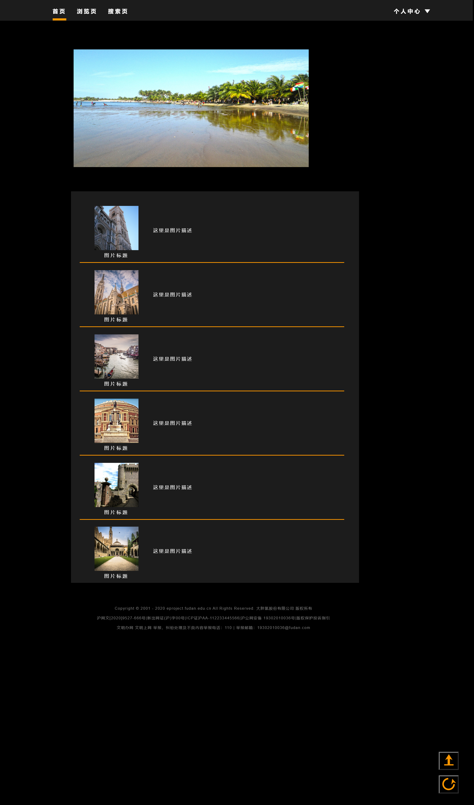  
***
其他页面的header与首页都是一样的，不同页面在不同标签下有下划线    
浏览页有aside，在左边，用<ul><li>分成三块   
main部分用script实现二级选择器效果  
页码为多个<a>  
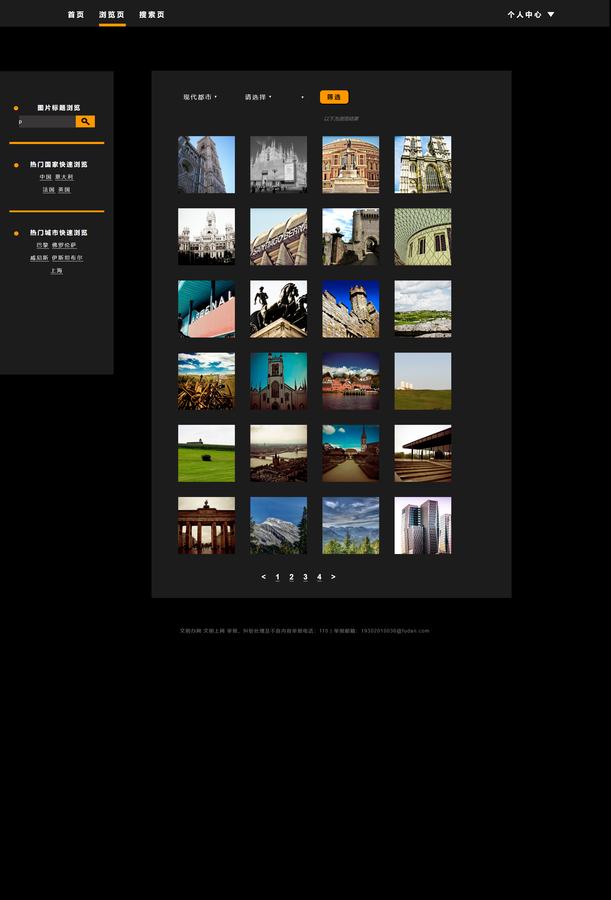  
***
search页面的main包含主标题<h1>，一个搜索栏
，显示图片与标题描述的<table>  
页码、页脚等都与之前相同  
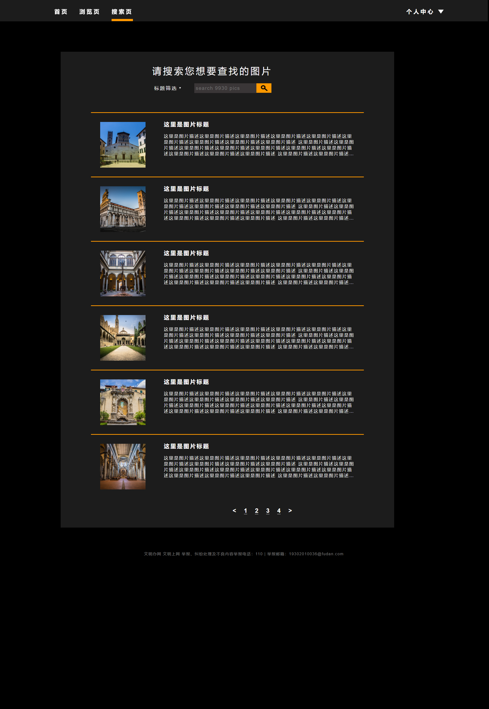  
***
upload页面用一个一行两列的table，左边是图片上传，右边是文字输入  
图片上传使用<input type="file">，因为这个元素无法设定样式，所以将其设为透明，使用<button>与之重叠  
用script实现图片上传。上传前框内显示“未上传”的图片，上传后改变图片class名以改变样式。  
文字输入用几个
排列，并将文字对齐。因为input不能输入多行所以用textarea来输入图片描述  
最后用<input type="submit">按钮提交  
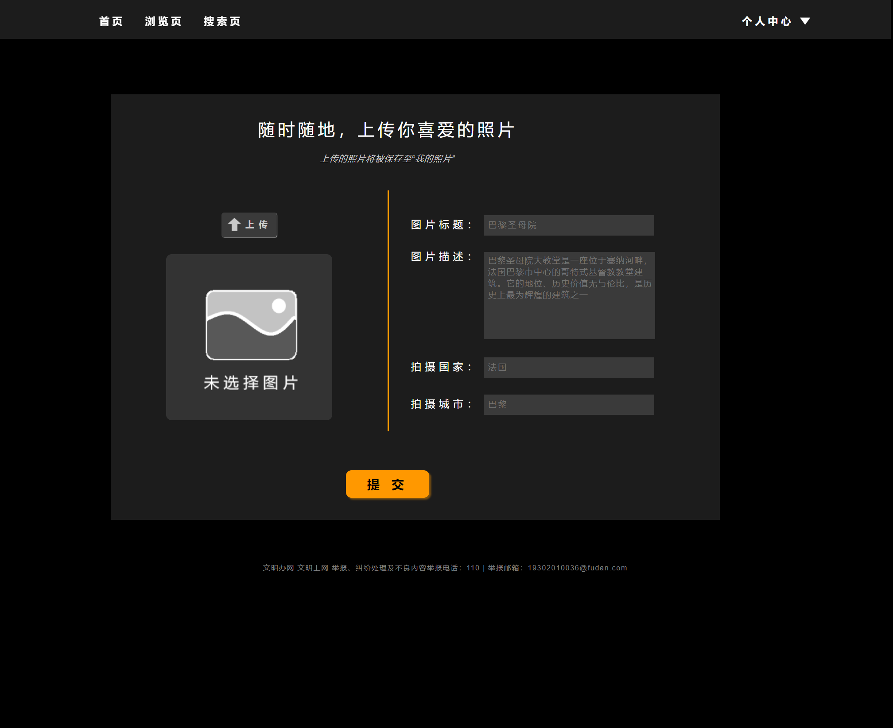  
***
我的照片布局与搜索页相似。  
在每一个td添加了两个button，删除和修改，并让其float:right  
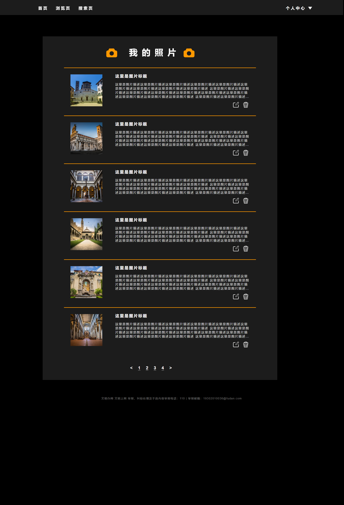  
***
收藏夹布局也相同   
额外增加了一个<td>，为取消收藏按钮  
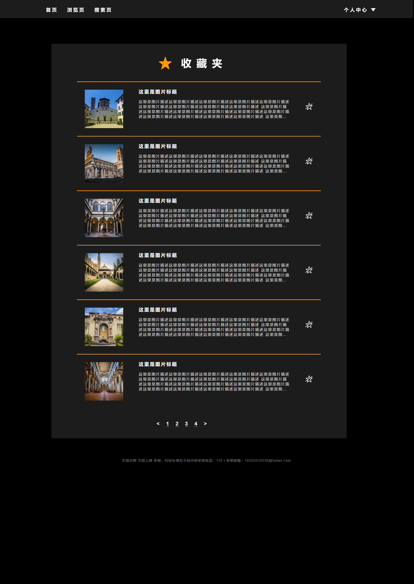  
***
登录界面简洁明了，<h1>之后多个
，每个
内都是图标+输入框  
最后提供登录按钮和注册链接    
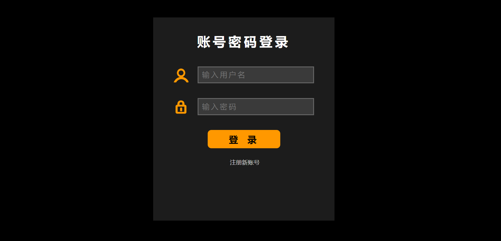  
***
注册界面布局与登录相同  
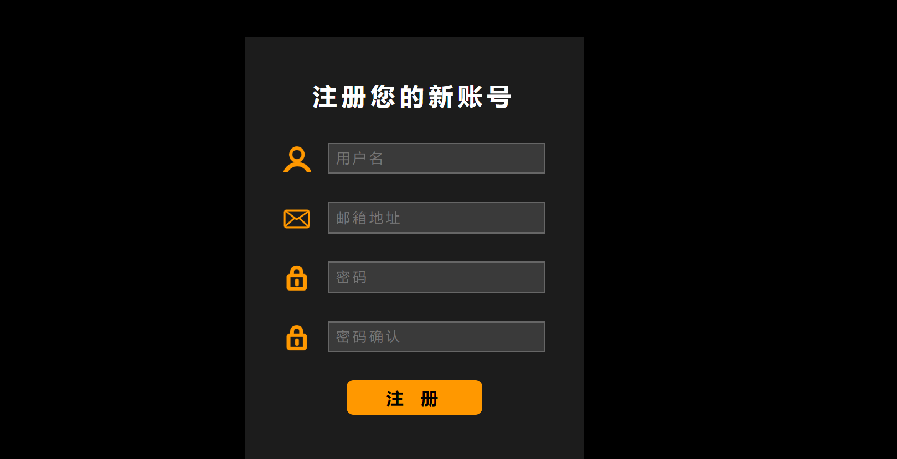  
***
图片详情页有标题，<table>一行两列，左边图片右边信息，再下方是图片描述，描述第一个字放大  
提供收藏按钮  
正文上下均有
分割线  
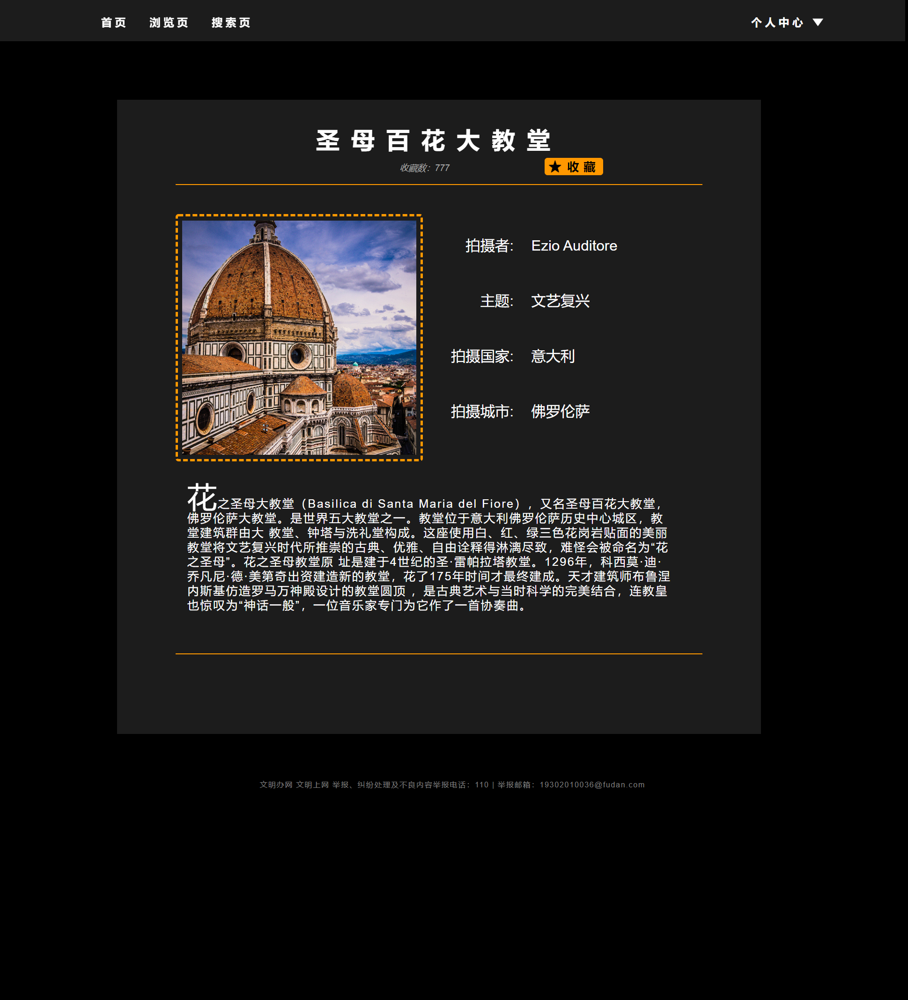  
###Bonus 完成情况
bonus已完成
图片裁剪使用以下css样式：
	`img.pic{
    width: 100%;
    height: 100%;
    object-fit: cover;
}

div.pic{
    height: 150px;
    width: 150px;
}`
其中img为 图片，div为容纳图片的块，其类均为pic  
object-fit :cover 能够让比例保持，保证替换内容尺寸大于容器尺寸，宽和高至少有一个与容器一致 
以下为图片对比  
 
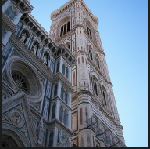
***
响应式布局使用以下代码实现：  
	`<meta name="viewport" content="width=device-width,initial-scale=1.0">`
然后就可以根据容器的宽度大小决定css样式单的采用。  
比如主页是这样的：
	`<link rel="stylesheet" href="reset.css" type="text/css">
        <link rel="stylesheet" href="src/css/index-common.css" type="text/css">
        <link media="(max-width:1175px)" rel="stylesheet" href="src/css/index-middle.css" type="text/css">
        <link media="(max-width:1020px)" rel="stylesheet" href="src/css/index-small.css" type="text/css">       
        <link media="(max-width:600px)" rel="stylesheet" href="src/css/index-mobile.css" type="text/css">`
它有四个样式单：common 、middle 、small 、 mobile  
一开始固定使用common，即大。当窗口缩小，引入middle，窗口再缩小引入small ，600px为识别移动端的尺寸，小于600px使用移动端样式  
其他页面也几乎相同，都是分这四个样式单，而注册与登录只需要common与mobile两个样式单即可  
一开始窗口缩小，因为main的margin-left和width固定所以右边无内容部分被遮盖，当窗口接近main时，变为middle样式，main的float为right，即浮动右侧，再缩小窗口就能缩小左边距离。再缩小到左边距离也所剩无几，变为small，整个页面被main所占据。此时部分界面再缩小则会遮盖main的部分内容，有些则不会。  
当缩小到mobile样式，将调整所有宽度单位。一般将px改成%方便在不同手机上定位。所有图片与按钮和字体也会进行相应的缩小  
以下举例：
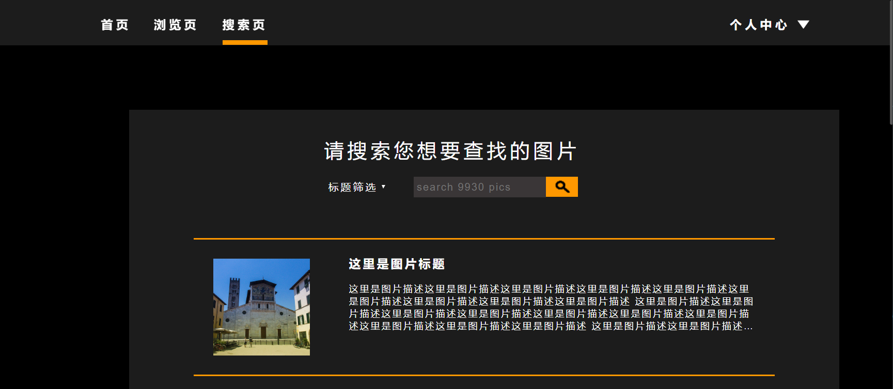
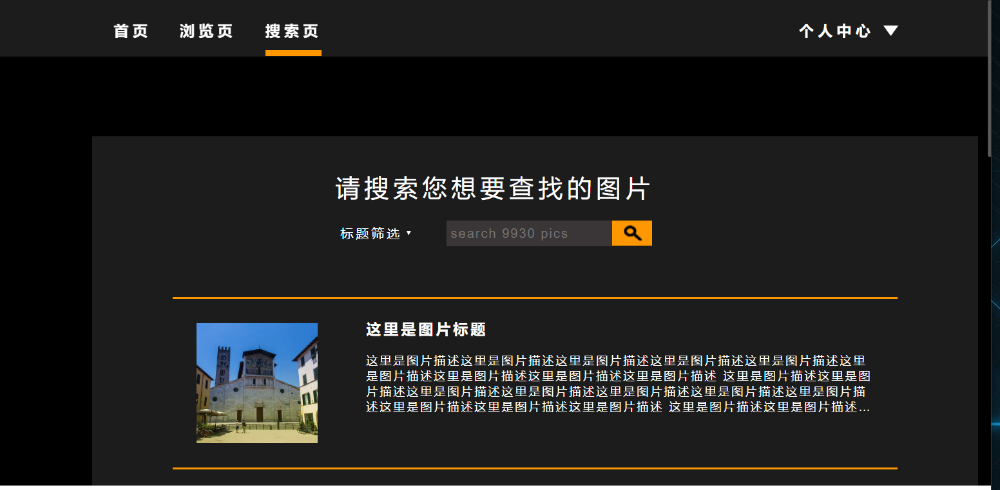
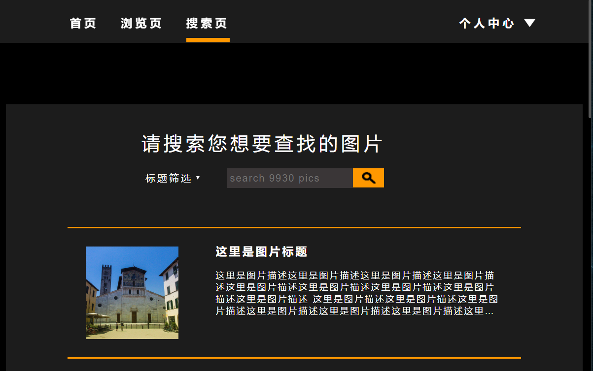
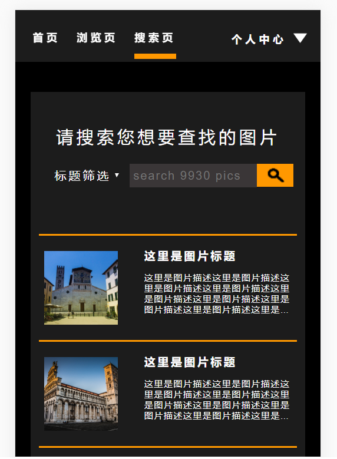
###对于pj1和课程的意见与建议
建议考试简单一些，A多一点，别给F~ 
